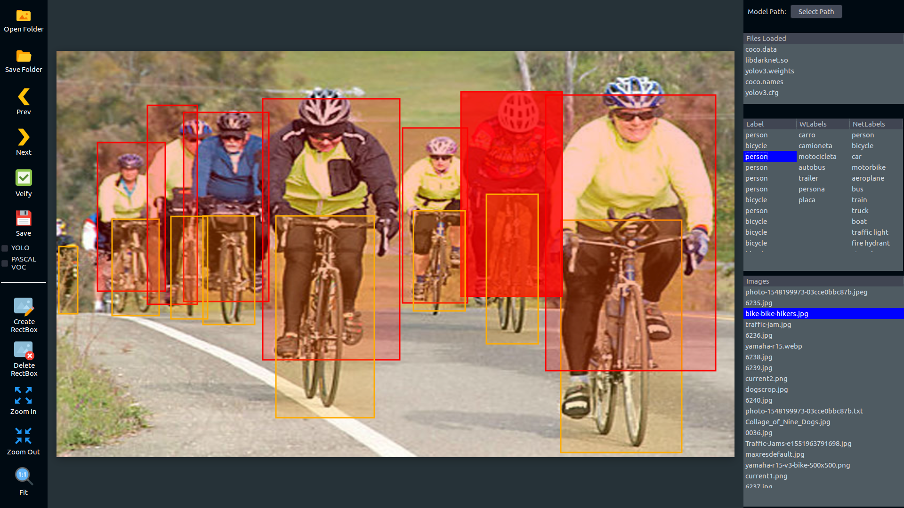

# DeepBoundingBoxTool
BoundingBoxTool with deep learning support to classify objects on images, at the first version will support darknet models.
This work is inspired by LabelImg:
Git code (2015). https://github.com/tzutalin/labelImg

Software dependencies:
*OpenCV
*Gtk3.0
*cairo
*darknet

The software is not finished yet, i'm working on this

The execution is:
python3 dbbt.py

