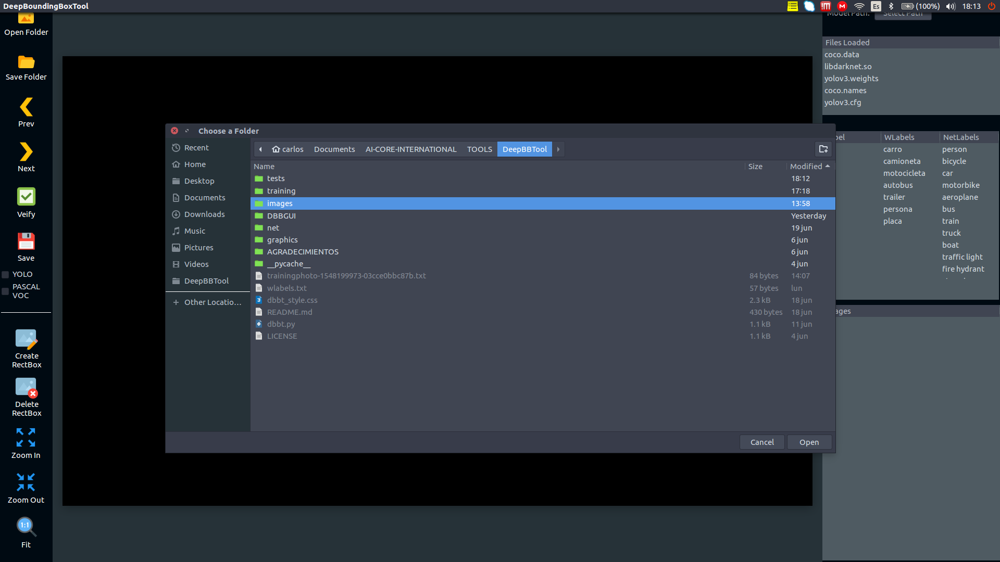

# DeepBoundingBoxTool
BoundingBoxTool with deep learning support to classify objects on images, at the first version will support darknet models.
This work is inspired by LabelImg:
Git code (2015). https://github.com/tzutalin/labelImg

Software dependencies:
*OpenCV
*Gtk3.0
*cairo
*darknet

The software is not finished yet, i'm working on this

The execution is:
python3 dbbt.py

#USE TUTORIAL
1. execute the program with:
 > python3 dbbt.py
2. press the select Path button on the top right to select the model Path:

3. Select the folder that contain the darknet model files (.cfg, .weights, .data, .names) including __libdarknet.so__, be sure of include the .names folder correctly on the .data file, the __.so__ file is generated when compile darknet, for this work is used the darknet version of __AlexeyAB__ [AlexeyAB Darknet](https://github.com/AlexeyAB/darknet), you must move the __.so__ generated of the darknet compilation to the __net__ folder, remember to put in this same folder the __.cfg, .weights, .data and .names__ files.
4. If all is working fine so you must se the files loaded, on the terminal must be loaded the darknet model without errors. 
5. Press the button open folder to open images folder path

6. Press open to open the folder

7. All is ready to start to work!!. 
